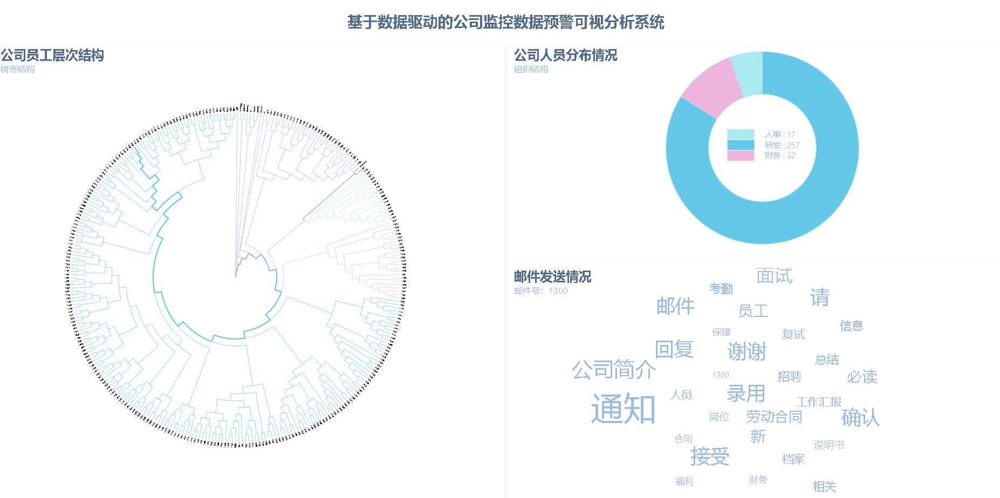
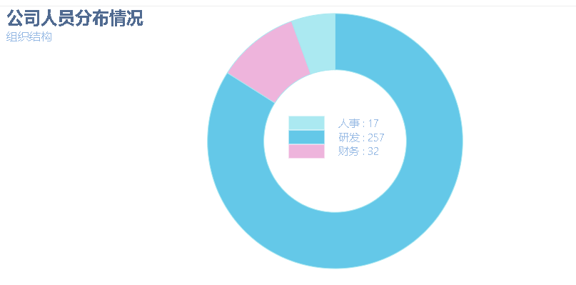
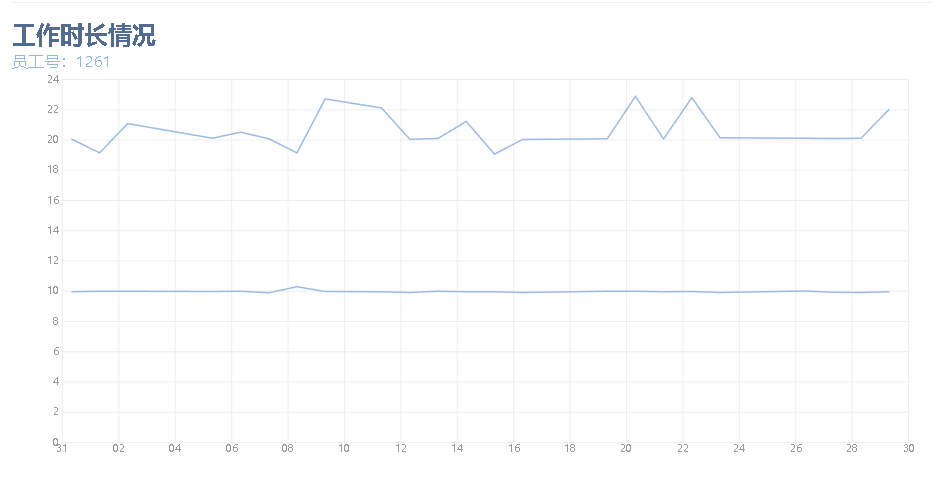
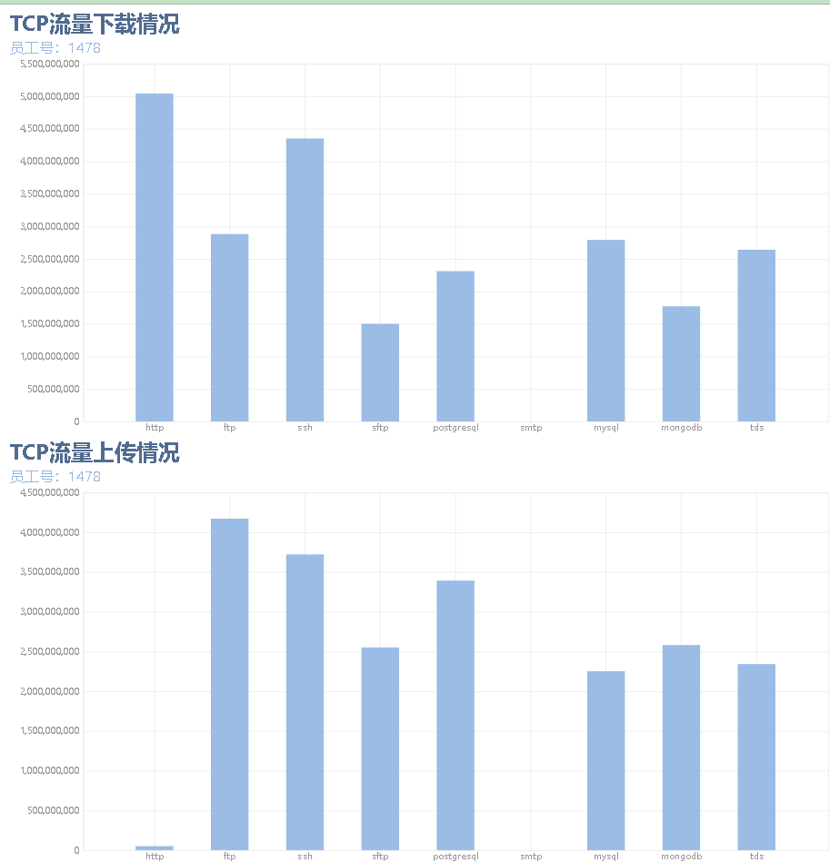
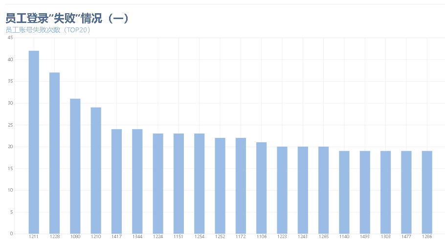
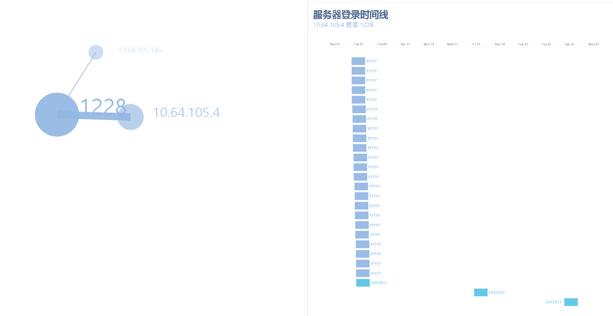
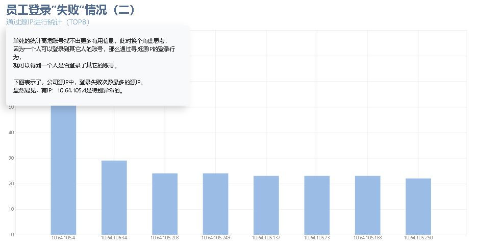

<!-- @import "[TOC]" {cmd="toc" depthFrom=1 depthTo=6 orderedList=false} -->

<!-- code_chunk_output -->

- [基于数据驱动的公司监控数据预警可视分析系统](#基于数据驱动的公司监控数据预警可视分析系统)
  - [分析思路](#分析思路)
  - [主视图 (层次聚类树)](#主视图-层次聚类树)
  - [辅助视图](#辅助视图)
    - [公司人员分布情况 (饼图)](#公司人员分布情况-饼图)
    - [员工工作时长情况。（折线图）](#员工工作时长情况折线图)
    - [员工经常访问的网站，关键字。（词云）](#员工经常访问的网站关键字词云)
    - [员工经常发送的邮件，关键字。（词云）](#员工经常发送的邮件关键字词云)
    - [员工流量上传和下载。（面积图）](#员工流量上传和下载面积图)
    - [登录日志](#登录日志)
    - [分析员工的打卡行为+分析员工的服务器登录行为](#分析员工的打卡行为分析员工的服务器登录行为)
    - [员工的源 IP 的登录行为。](#员工的源-ip-的登录行为)
  - [跳板登录的情况](#跳板登录的情况)
  - [盗号分析](#盗号分析)
  - [待完成预警分析](#待完成预警分析)

<!-- /code_chunk_output -->

# 基于数据驱动的公司监控数据预警可视分析系统

Chinavis 2018 年挑战赛。使用公司内部脱敏数据源，设计一套基于数据驱动的通用网 络日志可视分析系统。致力于帮助分析人员，更便捷、精准的挖掘网络日志中的异常事件。

## 分析思路

- 理解数据：根据给出的（登录，网站，TCP, 邮件，考勤）5 类日志，初步理解数据以及网络安全知识
- 分析数据：利用数据，对处理过后的邮件信息进行分析的得到公司员工的组织关系
- 挖掘数据：分析公司员工的工作行为，展示公司员工的正常工作模式
- 判断数据：根据前面的分析，公司运作模式和人员分析，获取其中的关联并得到威胁情报
- 预测响应：及时响应

## 主视图 (层次聚类树)

基于层次聚类算法，得到公司的组织层次结构如下:

## 辅助视图

### 公司人员分布情况 (饼图)

通过公司内部的邮件数据集，
提取文本关键字，通过余弦距离并且计算邮件之间的相似度。
将相似度通过余弦距离进行层次聚类，
得到 HighTech 公司 共分三个部门：
研发约有：256 人，
财务约有：32 人，
人事约有：17 人。

### 员工工作时长情况。（折线图）

通过员工考勤打卡数据，可以通过上下班时间，统计得到员工从 11 月 1 号到 11 月 30 号的上班时间段。以树图为主视图，通过点击员工工号，展示不同的员工工作时长。
通过分析，可得，大多员工的上班时间在 8-10 点之间，下班时间在 18 点-21 点之间，且极少休假。（换句话说，绝大部分员工都是处于 997 的工作状态之中。）

但是 针对单人的时长分析我们不能看出整体部门的工作的情况，所以我们采取按照之前划分的部门的情况来统计，可以发现明显的几个值，分别对应午休和例会时间，并且，并且在每日打卡中可以明显得出该公司一周双休，周末无特殊情况不加班，但技术人员的上班时长明显多余其它部门的人

### 员工经常访问的网站，关键字。（词云）

通过公司的网站访问日志数据，提取网站的域名主题词，进行自然语言处理，获取到该员工员工浏览的网站的关键词，将其用基于力导向算法的布局模型进行展示，提供缩放、拖拽功能。"

### 员工经常发送的邮件，关键字。（词云）

通过公司的邮件日志数据，提取邮件主题词，进行自然语言处理，获取到该员工员工发送邮件的特征词，并将其用基于力导向算法的布局模型进行展示，提供缩放、拖拽功能。

### 员工流量上传和下载。（面积图）

其中，公司各部门员工以及管理的邮件主题词云图，对每个主题的邮件发送时间进行统计，发现并无明显时间规律所以我们转向分析了人员的打卡情况，工作时长，上班时间浏览网站情况。

### 登录日志

精确到每个人的行为。查看，前 N 位，员工登录的次数，寻觅登录失败最多的人的工号。精确到每一天。目的：找到最异常的员工。（1487），同时，通过分析，我们发现，1487，1376，1281 在 28 号都离职了，实属异常，并且 1487 和 1376 经常浏览招聘网站，两人的工作岗位接近（相似度高）很有可能有问题

### 分析员工的打卡行为+分析员工的服务器登录行为

偷偷摸摸登录服务器，肯定要干坏事。

### 员工的源 IP 的登录行为。

。

我们开始注意 1487 这个人，多次尝试自己组长的账号后，在 6 号多次进行尝试登录，并且最终成功，如下图 ：

之后明显的在 16 日和 24 日再次使用组长的账号登录，当我们去观察 16 号和 24 号的流量情况，发现账号 1228 确实下载了大量数据，并且在 24 号向外部服务器是上载了 572M 的数据。

## 跳板登录的情况

锁定的登录失败的情况

1487 的源 IP 为：10.64.105.4

1228 的源 IP 为：10.64.105.146
通过 10.64.105.4 登录到 10.50.50.43

## 盗号分析

1487 登录的其它的 ip 是可以找到的，并且明显的人为感知，他在尝试破解 1211 1228 1080 ，并且在多次尝试过后成功破解到 1228 通过之前的分析，我们知道 1228 是个小组长，那么就可以合理推断，他偷偷窃取了组长的密码，并且进行了尝试性破解，而且成功了，那么接下来，我们就可以看，破解之后，他什么时候又要去登录，登陆了去干了什么，就是一个平行坐标了，并且根据画出的来的，我们可以去看具体到某天他去登陆了，并且有操作，但是没有平行坐标那么明显。

## 待完成预警分析

1. 网站类型（通过域名，判断其网站类型（语义分析），通过雷达图进行人员工作行为分析，就可以得到平时爱干什么，） 如果招聘出现的多的话，就证明有跳槽的风险，接着就是下面网站类型的雷达图

2. 离职人员（为什么要离职呢？干了坏事 或者是 公司不怎么样） 进行离职分析的话，在离职之前的时间段里面，他干了啥，通过 IP 去看，这里就是下面的寻觅邮件有辞职信的，关键字查询，（查询的小型系统，查了就可以找到对应的有哪些邮件，对应的人就可以找到了）

3. 跳板攻击（平行坐标表示，这个人通过这个 ip 去登录了其他的 ip 调查他访问的 ip 的流量下载上传情况，这段时间应该着重在看招聘网站到离职之间，万一要干坏事呢？）平行坐标来个概念图
   3.1 或者是想干坏事，才去看招聘网站，为自己打掩护.
